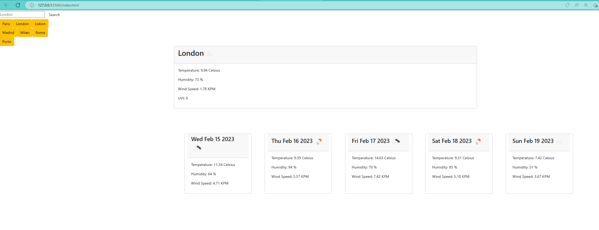
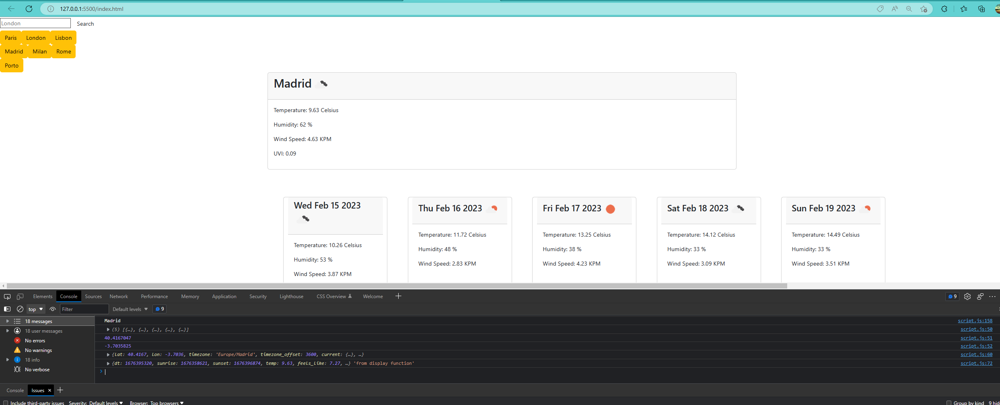

# Weather Report API

## Description
The Weather Report is a website you can use to search for any city in the search browser. It will display the city name, temperature, longitude and latitude in the search results.
Users can see the results for the next 5 days from the present day with details of the weather. The search results history are stored in local storage and displayed on the left hand side. This will allow users to know the forecast of the weather in advance so they can plan ahead of their travels or know out of interest.

## Table of Contents:
- [Description](#description)
- [How-it-works](#how-it-works)
- [Usage](#usage)
- [Reference](#reference)
- [Deployment-Link](#deployment-link)

## How it works
The Weather Report application uses an API key to fetch a comprehensive weather report for a city and stores it in local storage. On clicking a city, we displayed its temperature, humidity, wind speed, dates and forecast for the next five days. We made two API requests using fetch, one for the city location and the other for longitude and latitude. The response was logged in JSON format and displayed using Bootstrap.

## Usage
1. Load Weather Report webpage
2. Type in a city in the search results and click search button
3. City and weather details will display the forcast for the next 5 days. 
* These include:
    * The city name
    * The date
    * An icon representation of weather conditions
    * The temperature
    * The humidity
    * The wind speed
4. Cities searched are stored to local storage for faster results and comparisons.

## Reference
Please see screenshots for references:

>

## Deployment Link 
[Weather-Report](https://afroneo.github.io/WeatherReport/)

